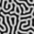
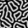
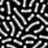
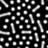
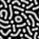
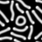

# Reaction-Diffusion Studio

Turn any image into a reaction-diffusion painting. Load a photo or drawing,
pick how many colors to keep, choose a pattern for each color (coral,
labyrinth, maze, fingerprints…), and watch the simulation grow organic
textures inside each color region. Save the result as a still or a video.

<!-- Replace this with a hero GIF or PNG once you pick one. -->
<!--  -->

> **No coding required.** Just download, install, and run. Works on Mac and
> Windows. Source code is here too — see *Advanced* at the bottom if you want it.

---

## Try it in your browser

[**Open the web demo →**](https://huggingface.co/spaces/raulnmateos/rdstudio)
&nbsp;[](https://huggingface.co/spaces/raulnmateos/rdstudio)

No install — runs in any modern browser. Free CPU, so it caps inputs at
512 px and 3000 iterations (~30 s per run). For larger images, longer
runs, video export, and per-color patterns, download the desktop app
below.

---

## Download

| Platform | Link | Notes |
|---|---|---|
| **macOS** (Apple Silicon, M1/M2/M3/M4) | [**Download `.dmg`** (`-arm64`)](https://github.com/rmateosr/rdstudio/releases/latest) | Native build for M-series Macs |
| **macOS** (Intel, pre-2020) | [**Download `.dmg`** (`-x86_64`)](https://github.com/rmateosr/rdstudio/releases/latest) | Native build for Intel Macs |
| **Windows** (10 / 11, 64-bit) | [**Download `.zip`**](https://github.com/rmateosr/rdstudio/releases/latest) | Roughly 100 MB |

Pick your platform on the GitHub Releases page, click the file, save it
somewhere you can find (the Downloads folder is fine).

---

## First time on a Mac

Apple shows a warning the first time you open any app it didn't sell you.
You only have to do this once.

1. Open the **`.dmg`** file you downloaded (double-click it).
2. A window opens showing **Reaction-Diffusion Studio** next to your
   **Applications** folder. **Drag the app onto Applications.**
3. Open **Applications** (Finder → Applications, or `⌘ ⇧ A`).
4. Find **Reaction-Diffusion Studio**. **Right-click it** (or hold ⌃ Control
   and click) → choose **Open**.
5. macOS will say *"Apple could not verify Reaction-Diffusion Studio is free
   of malware."* Click **Open** anyway.
6. From now on, normal double-click works.

> If right-click → Open doesn't show "Open" as an option, try System Settings
> → Privacy & Security; you'll see a message about the blocked app with an
> **Open Anyway** button there.

The warning is because the app is unsigned (Apple charges $99/year to sign
apps, which we haven't paid for v0.1.0). The app itself is the same code you
can read in this repository.

---

## First time on Windows

1. Open the **`.zip`** file you downloaded.
2. Right-click → **Extract All…** → pick somewhere (Desktop is fine) → Extract.
3. Open the extracted folder and double-click **`Reaction-Diffusion Studio.exe`**.
4. Windows may say *"Windows protected your PC."* Click **More info** →
   **Run anyway**.
5. From now on, just double-click the `.exe` to launch.

Same reason as Mac: the app isn't code-signed yet. Skipping the warning is
safe — the code is open and right there in this repo.

---

## How to use it

1. **Load image.** Any photo, drawing, or screenshot — JPG, PNG, anything
   common.
2. **Number of colors.** The app reduces the image to that many color regions.
   3–6 is a good starting range.
3. **Pattern.** Pick one (coral, labyrinth, maze, …). The simulation grows
   that pattern inside every color region. Use **Per color…** if you want a
   different pattern for each color.
4. **Run.** Watch the preview update live. Stop whenever it looks good.
5. **Save image** to get the final PNG. **Save video** to get an MP4 of the
   growth.

Two modes to try:

- **Sharp zones** (default) — each color stays inside its region; patterns
  hit hard boundaries.
- **Bleeding colors** — colors leak across boundaries as the simulation runs.
  Softer, more painterly result.

---

## Pattern gallery

<table>
<tr>
  <td align="center"><br><b>coral</b></td>
  <td align="center"><br><b>maze</b></td>
  <td align="center"><br><b>short worms</b></td>
</tr>
<tr>
  <td align="center"><br><b>sparse stripes</b></td>
  <td align="center"><br><b>sparse worms</b></td>
  <td align="center"><br><b>stripe fragments</b></td>
</tr>
</table>

There are more presets inside the app (fingerprints, mitosis, solitons,
wavelets, zebrafish…) plus a per-color override and a "random" option.

---

## Tips

- **Disable a color** to drop it out of the simulation — useful when the
  quantizer captures a bright sky or a white background you don't want
  patterned. Uncheck the swatch under "Colors".
- **Image size**: Small / Medium / Large / Giant. Bigger = slower; the cost
  is roughly quadratic. Medium (1024 px) is a good default; Large for final
  exports.
- **Simulation length**: Short / Medium / Long / Very long. Longer runs let
  patterns settle into stable shapes; shorter runs catch the messy growth
  phase, which can look more painterly.
- **Edge softness** rounds the boundaries between color regions before the
  patterns start growing. Higher = more painterly fades; zero = pixel-sharp
  zones.
- The **▸ Advanced** disclosure inside the app hides knobs you probably
  don't need (preview frequency, seed placement, pixel-art handling).
  Open it if you're curious.

---

## Credits & background

Gray-Scott reaction-diffusion is a two-chemical model that spontaneously
forms biological-looking patterns. Classic references:

- **John E. Pearson** — *Complex Patterns in a Simple System* (Science, 1993).
  The paper that catalogued the f/k parameter space these presets are drawn from.
- **Robert Munafo** — [mrob.com/pub/comp/xmorphia](https://mrob.com/pub/comp/xmorphia/).
  The definitive interactive tour of Pearson's parameter space.

The image-driven workflow (use any photo as a zoning mask, grow a different
pattern in each color region) is the contribution of this app.

---

## License

[MIT](LICENSE).

---

## Advanced — running from source

If you have Python 3.10+ installed and want to skip the bundled app:

```bash
git clone https://github.com/rmateosr/rdstudio
cd rdstudio
pip install -e .
python -m rdstudio          # launch the GUI
rdstudio-cli input.png -o output.png -n 5   # CLI engine, no GUI
```

Build a fresh `.exe` / `.app` yourself:

```bash
pip install -e .[build]
pyinstaller --noconfirm --clean rdstudio.spec
# Result: dist/Reaction-Diffusion Studio/
```

On Windows, `scripts\build_windows.cmd` wraps the whole thing.

The release workflow at [`.github/workflows/release.yml`](.github/workflows/release.yml)
builds Mac + Windows artifacts on every `v*` tag. See `RELEASE_PLAN.md` for
the full development plan.
